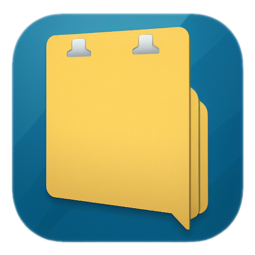
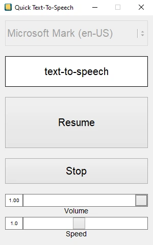

#  Quick Text-To-Speech

A simple TTS tool for Windows that reads directly from the clipboard or from textfiles that are dragged into the window.

## Screenshot:

## Features:

- Single executable file of ~1 MB size
- No installation necessary
- Change playback rate as its speaking
- Currently active phrase is displayed in "speed-reader" fashion
- Stores config in ``%appdata%\.qtts``
- GUI based on fltk-rs and the work of the FLTK project (https://www.fltk.org)